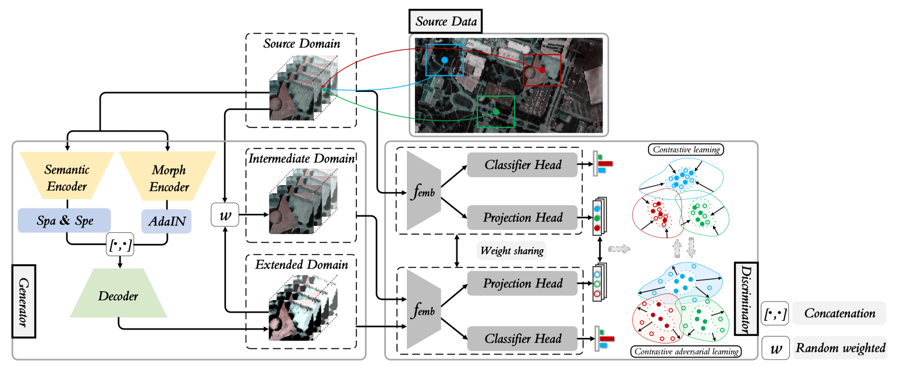

# Single-source Domain Expansion Network for Cross-Scene Hyperspectral Image Classification

Paper web page: [Single-source Domain Expansion Network for Cross-Scene Hyperspectral Image Classification](https://ieeexplore.ieee.org/document/10050427/).

Reading [知乎-Yammo](https://zhuanlan.zhihu.com/p/562084403)

<p align='center'>
  
</p>

## Abstract

Currently, cross-scene hyperspectral image (HSI) classification has drawn increasing attention. It is necessary to train a model only on source domain (SD) and directly transferring the model to target domain (TD), when TD needs to be processed in real time and cannot be reused for training. Based on the idea of domain generalization, a Single-source Domain Expansion Network (SDEnet) is developed to ensure the reliability and effectiveness of domain extension. The method uses generative adversarial learning to train in SD and test in TD. A generator including semantic encoder and morph encoder is designed to generate the extended domain (ED) based on encoder-randomization-decoder architecture, where spatial randomization and spectral randomization are specifically used to generate variable spatial and spectral information, and the morphological knowledge is implicitly applied as domain invariant information during domain expansion. Furthermore, the supervised contrastive learning is employed in the discriminator to learn class-wise domain invariant representation, which drives intra-class samples of SD and ED. Meanwhile, adversarial training is designed to optimize the generator to drive intra-class samples of SD and ED to be separated. Extensive experiments on two public HSI datasets and one additional multispectral image (MSI) dataset demonstrate the superiority of the proposed method when compared with state-of-the-art techniques. 

## Paper

Please cite our paper if you find the code or dataset useful for your research.

```
@ARTICLE{10050427,
  author={Zhang, Yuxiang and Li, Wei and Sun, Weidong and Tao, Ran and Du, Qian},
  journal={IEEE Transactions on Image Processing}, 
  title={Single-source Domain Expansion Network for Cross-Scene Hyperspectral Image Classification}, 
  year={2023},
  volume={},
  number={},
  pages={1-1},
  doi={10.1109/TIP.2023.3243853}}

```

## Requirements

CUDA Version: 11.3

torch: 1.11.0

Python: 3.8.10

## Dataset

The dataset directory should look like this:

```bash
datasets
├── Houston
│   ├── Houston13.mat
│   ├── Houston13_7gt.mat
│   ├── Houston18.mat
│   └── Houston18_7gt.mat
└── Pavia
    ├── paviaC.mat
    └── paviaC_7gt.mat
    ├── paviaU.mat
    └── paviaU_7gt.mat

```

## Usage

1.You can download [Houston &amp; Pavia](https://github.com/YuxiangZhang-BIT/Data-CSHSI) dataset here.

2.You can change the `source_name` and `target_name` in train.py to set different transfer tasks.

3.Run the following command:

Houston dataset:
```
python train.py --source_name Houston13 --target_name Houston18 --re_ratio 5 --training_sample_ratio 0.8 --d_se 64 --lambda_1 1.0 --lambda_2 1.0
```
Pavia dataset:
```
python train.py --source_name paviaU --target_name paviaC --re_ratio 1 --training_sample_ratio 0.5 --d_se 64 --lambda_1 1.0 --lambda_2 1.0
```

## Note

- The variable names of data and gt in .mat file are set as `ori_data` and `map`.
- For Pavia dataset and Houston dataset, args.re_ratio is set to 1 and 5, respectively
